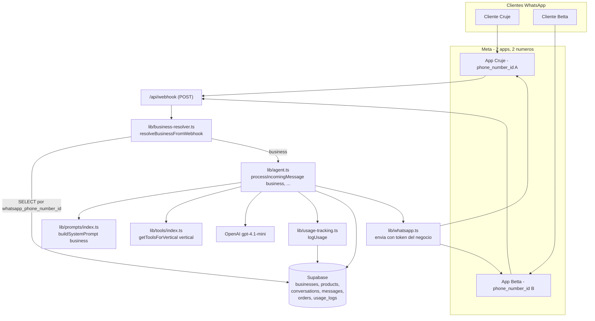

# Arquitectura v2 — Plataforma multi-tenant (Aynibot)

> Extiende `architecture.md` (v1, Cruje). **No reemplaza** el v1; documenta los cambios para soportar múltiples negocios bajo el mismo código. "Aynibot" es el nombre comercial de la plataforma (temporal), usado solo en la landing/UI; el repo y las variables internas no se renombran.

## Cambio central

v1 asumía un único negocio (`CRUJE_BUSINESS_ID` hardcodeado). v2 **resuelve el negocio en runtime** a partir del `phone_number_id` que Meta incluye en cada webhook. Un mismo endpoint `/api/webhook` atiende a Cruje, Betta y futuros clientes.

## Diagrama de flujo (v2)

## Secuencia de un mensaje entrante (v2)

1. Cliente envía mensaje; Meta hace `POST /api/webhook`.
2. El webhook extrae `entry[].changes[].value.metadata.phone_number_id`.
3. `resolveBusinessFromWebhook(payload)` busca en `businesses` por `whatsapp_phone_number_id`. Si no existe → log y `200 OK` (se ignora, no se rompe).
4. Extrae `from` y `text.body`.
5. Carga/crea conversación por `(business.id, customer_phone)`.
6. Guarda mensaje del cliente en `messages`.
7. **Si `conversation.mode === 'human'`** → no se invoca OpenAI (ver `operations-spec-v2.md`); termina.
8. Construye prompt con `buildSystemPrompt(business)` y tools con `getToolsForVertical(business.vertical)`.
9. Ciclo multi-turno con OpenAI (igual que v1).
10. Registra uso en `usage_logs` vía `logUsage`.
11. Guarda respuesta y la envía con `sendWhatsAppMessage` usando **el token del negocio** (no env global).

## Módulos nuevos / modificados

### `lib/business-resolver.ts` (nuevo)

- `resolveBusinessFromWebhook(payload): Promise<Business | null>` — extrae `phone_number_id` del payload de Meta y devuelve la fila de `businesses` (o `null` si no hay match).
- `getBusinessByPhoneNumberId(phoneNumberId): Promise<Business | null>` — helper de consulta cacheable.
- Tipo `Business` con todas las columnas (incluye `vertical`, `whatsapp_token`, `owner_whatsapp_number`, `system_prompt_custom`, `shopify_domain`).

### `lib/agent.ts` (modificado)

- `processIncomingMessage(business: Business, customerPhone: string, text: string)` — ya **no** asume Cruje; recibe el `business` resuelto.
- Todas las tools internas usan `business.id` en vez de `CRUJE_BUSINESS_ID`.
- `notifyOwner` usa `business.owner_whatsapp_number` y `business.whatsapp_token`.
- Llama a `logUsage(business.id, usage)` tras cada respuesta de OpenAI.
- **Compatibilidad v1**: `CRUJE_BUSINESS_ID` permanece como constante (Cruje conserva su id), pero deja de ser la fuente de ruteo.

### `lib/prompts/index.ts` (nuevo)

- `VERTICAL_TEMPLATES: Record<'bakery' | 'retail', string>`.
- `buildSystemPrompt(business): string` = plantilla del vertical + `business.system_prompt_custom` + contexto runtime. Ver `agent-spec-v2.md`.

### `lib/tools/index.ts` (nuevo)

- `getToolsForVertical(vertical): ChatCompletionTool[]`.
- Tools comunes + condicionales por vertical (bakery incluye `iniciar_encargo_personalizado`; retail no). `escalar_a_humano` en ambos. Ver `agent-spec-v2.md`.

### `lib/shopify-ingestion.ts` (nuevo)

- `ingestShopifyCatalog(businessId, shopifyDomain)` — descarga `{dominio}/products.json`, mapea y hace upsert en `products`. Ver `catalog-ingestion-spec-v2.md`.

### `lib/usage-tracking.ts` (nuevo)

- `logUsage(businessId, { inputTokens, outputTokens, model })` — inserta en `usage_logs` con costo estimado. Ver `usage-tracking-spec-v2.md`.

### `lib/whatsapp.ts` (modificado)

- `sendWhatsAppMessage(to, text, { token, phoneNumberId })` — recibe credenciales por parámetro (del negocio) en vez de leer solo env globals.
- Mantiene fallback a env globals para compatibilidad con Cruje si aún no migró sus credenciales a columnas (transición).

### `app/api/webhook/route.ts` (modificado)

- GET: verificación Meta (sin cambios; el `WHATSAPP_VERIFY_TOKEN` puede seguir siendo global para todas las apps, ya que cada app de Meta usa el mismo verify token configurado).
- POST: resuelve negocio → chequea `mode` → invoca agente.

## Variables de entorno: globales vs. por negocio

| Dónde vive | Valor | Razón |
|---|---|---|
| **Env global (Vercel)** | `NEXT_PUBLIC_SUPABASE_URL` | Una sola instancia de Supabase |
| **Env global** | `NEXT_PUBLIC_SUPABASE_ANON_KEY` | — |
| **Env global** | `SUPABASE_SERVICE_ROLE_KEY` | Acceso servidor compartido |
| **Env global** | `OPENAI_API_KEY` | Una sola cuenta OpenAI; el uso se atribuye por `usage_logs` |
| **Env global** | `WHATSAPP_VERIFY_TOKEN` | Compartido entre apps de Meta (mismo string en cada app) |
| **Columna en `businesses`** | `whatsapp_phone_number_id` | Identifica al negocio; UNIQUE |
| **Columna en `businesses`** | `whatsapp_token` | Token de la app de Meta de ese negocio |
| **Columna en `businesses`** | `owner_whatsapp_number` | Número del dueño para notificaciones |

> `OWNER_WHATSAPP_NUMBER`, `WHATSAPP_TOKEN` y `WHATSAPP_PHONE_NUMBER_ID` dejan de usarse como env globales para el ruteo; quedan como fallback de Cruje durante la transición y luego se pueden retirar.

## Decisiones de diseño (v2)

- **Ruteo por `phone_number_id`**: es el dato estable que Meta envía siempre; el `UNIQUE` en la columna impide colisión entre negocios.
- **Una cuenta OpenAI, atribución por logs**: simplicidad; el costo por negocio se calcula en `usage_logs`.
- **Credenciales WhatsApp en BD**: permite onboarding de clientes sin tocar env vars de Vercel.
- **`orders` no cambia de forma estructural**: sirve igual para ambos verticales (las nuevas columnas operativas se agregan en `operations-spec-v2.md`, pero el modelo conceptual es el mismo).
- **Compatibilidad**: Cruje no se rompe; su fila se actualiza (no se recrea) y conserva id, productos, conversaciones y pedidos.
