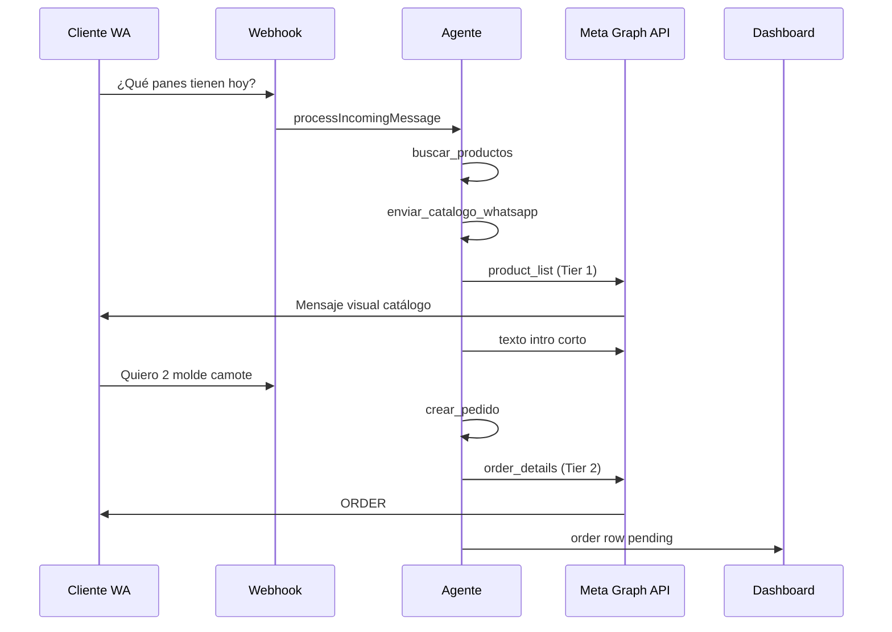

# Spec — WhatsApp: mensajes ricos (catálogo visual + confirmación pedido)

> **ESTADO: PENDIENTE DE APROBACIÓN**
> **Índice:** [`catalog-images-whatsapp-index.md`](./catalog-images-whatsapp-index.md)
> **Depende de:** [`catalog-images-storage-spec.md`](./catalog-images-storage-spec.md) (URLs públicas de imagen)
> **Referencia visual:** screenshot Cruje — ORDER #, thumbnails, "View details", total PEN

---

## 1. Problema

Cuando el cliente pregunta por productos o stock, el bot responde **texto plano**.
Al confirmar pedido, igual — sin el formato nativo de WhatsApp Commerce que Cruje ya
usa manualmente (ver screenshot).

**Objetivo:** acercarse al UX nativo de WhatsApp con degradación graceful si Meta
Catalog no está configurado.

---

## 2. Cómo funciona WhatsApp (Meta Cloud API)

### 2.1 Tipos de mensaje relevantes

| Tipo | API `interactive.type` | Requisito | Uso |
|---|---|---|---|
| **Multi-product** | `product_list` | Catálogo Meta + `catalog_id` + `product_retailer_id` | "¿Qué tienes en stock?" |
| **Single product** | `product` | Idem | Un solo producto |
| **Order details** | `order_details` | Payments / order config (varía por país) | Confirmación con ítems |
| **Imagen + caption** | `image` | URL pública HTTPS | Fallback sin Meta Catalog |

### 2.2 Screenshot Cruje (interpretación)

El mensaje muestra:

- Header `ORDER #4VDXCNASWDU`
- Thumbnail + resumen ítems + `Total PEN 67.00`
- Botón **View details** → pantalla con líneas, subtotal, shipping
- Estado **Pending** + CTA **Confirm order info**

Esto corresponde al flujo **WhatsApp Commerce / Catalog Orders**, no a un texto generado
por el LLM. Para replicarlo desde el bot hay **dos caminos**:

| Camino | Descripción |
|---|---|
| **A — Meta Catalog nativo** | Productos en catálogo Meta → `product_list` al consultar; `order_details` al confirmar |
| **B — Híbrido** | Imágenes + texto estructurado + (si API lo permite) `order_details` sin pago integrado |

**CP-WA3:** v1 **sin** botón de pago nativo WhatsApp → Yape manual sigue en dashboard.
El CTA puede ser informativo ("Confirm order info") solo si Meta lo permite sin Payments;
si no, usar mensaje visual alternativo (Tier 3).

---

## 3. Arquitectura por tiers (degradación)

```
consulta stock / productos
        │
        ├─ Tier 1: Meta Catalog OK ──► product_list (≤30 ítems)
        │
        └─ Tier 3: sin catalog ─────► N× image+caption (≤5) + texto resumen

confirmar pedido (crear_pedido)
        │
        ├─ Tier 2: order_details OK ► mensaje ORDER nativo
        │
        └─ Tier 3: fallback ────────► texto estructurado + imagen primer ítem
```

Config por negocio en `businesses`:

```sql
ALTER TABLE businesses
  ADD COLUMN IF NOT EXISTS whatsapp_catalog_id text,
  ADD COLUMN IF NOT EXISTS whatsapp_rich_messages_enabled boolean NOT NULL DEFAULT true;
```

---

## 4. Tier 1 — Meta Catalog + product_list

### 4.1 Prerequisitos operativos (CP-WA1)

1. Catálogo creado en Meta Commerce Manager.
2. Vinculado al WhatsApp Business Account de Cruje.
3. `whatsapp_catalog_id` guardado en `businesses` (Perfil o admin).

### 4.2 Sync producto → Meta Catalog

`lib/whatsapp-catalog-sync.ts` (nuevo):

```typescript
export async function upsertProductToMetaCatalog(
  business: Business,
  product: ProductRow
): Promise<{ retailerId: string; metaProductId?: string }>
```

Mapeo:

| Campo Aynibot | Campo Meta |
|---|---|
| `products.id` o `external_id` | `retailer_id` (SKU string, max 100 chars) |
| `name` | name |
| `description` | description |
| `resolveProductImage().url` | image_url (**HTTPS público**) |
| `price_soles` | price (100 × soles, currency PEN) |
| `available` | availability |

Triggers sync:

- `saveProduct` (manual) post-upload imagen
- `ingestShopifyCatalog` batch
- Botón dashboard "Publicar catálogo a WhatsApp" (full sync)

Errores Meta → log + no bloquear save local.

### 4.3 Envío `product_list`

`lib/whatsapp-messages.ts` (nuevo, extiende `lib/whatsapp.ts`):

```typescript
export async function sendProductListMessage(
  to: string,
  creds: WhatsAppCredentials,
  opts: {
    catalogId: string
    header: string
    body: string
    footer?: string
    sections: Array<{
      title: string
      productRetailerIds: string[]
    }>
  }
): Promise<WhatsAppSendResult>
```

Límites Meta: **30 productos** total, **10 secciones**. Agrupar por `category`:

```typescript
// Ej: { title: "Panes", product_items: [{ product_retailer_id: uuid }] }
```

### 4.4 Integración agente

**Problema:** el LLM devuelve texto; el catálogo visual es programmatic.

**Solución:** tool dedicada + hook post-tool.

#### Tool `enviar_catalogo_whatsapp`

```json
{
  "name": "enviar_catalogo_whatsapp",
  "description": "Envía al cliente un mensaje visual de WhatsApp con productos del catálogo. Usar cuando pregunte qué hay, stock, promos o quiera ver productos. Primero usa buscar_productos para obtener IDs.",
  "parameters": {
    "type": "object",
    "properties": {
      "product_ids": {
        "type": "array",
        "items": { "type": "string" },
        "description": "UUIDs de productos a mostrar (máx 30)"
      },
      "mensaje_intro": {
        "type": "string",
        "description": "Texto corto de contexto, ej. 'Estas son nuestras ofertas de la semana'"
      }
    },
    "required": ["product_ids", "mensaje_intro"]
  }
}
```

Handler:

1. Valida IDs pertenecen al negocio y `available=true`.
2. Si `whatsapp_catalog_id` → `sendProductListMessage`.
3. Else → Tier 3 (`sendProductGalleryFallback`).
4. Retorna al modelo: `{ sent: true, format: 'product_list' | 'image_fallback', count: N }`.

Prompt (`lib/prompts/index.ts`):

```
- Cuando el cliente pregunte qué hay, stock, promos o precios de varios productos,
  usa buscar_productos y luego enviar_catalogo_whatsapp (no listes todo en texto largo).
- Puedes añadir un mensaje corto de texto además del catálogo visual.
- Para un solo producto, enviar_catalogo_whatsapp con un ID o usar buscar + texto breve.
```

---

## 5. Tier 2 — Confirmación pedido (ORDER format)

### 5.1 Cuándo enviar

Tras `crear_pedido` exitoso en `lib/agent.ts`, además del texto del asistente:

```typescript
await sendOrderConfirmationMessage({
  business,
  customerPhone,
  order: { id, items, total_soles, ... },
  products: enrichedWithImages,
})
```

### 5.2 Payload `order_details` (explorar en sandbox)

Basado en Meta Postman collection — estructura objetivo:

```json
{
  "type": "interactive",
  "interactive": {
    "type": "order_details",
    "body": { "text": "Tu pedido en Cruje está registrado ✅" },
    "action": {
      "name": "review_and_pay",
      "parameters": {
        "reference_id": "<order.id short>",
        "type": "physical-goods",
        "currency": "PEN",
        "total_amount": { "value": 6700, "offset": 100 },
        "order": {
          "status": "pending",
          "items": [
            {
              "retailer_id": "<product.id>",
              "name": "Molde de Camote - Molde Grande",
              "amount": { "value": 2100, "offset": 100 },
              "quantity": 1
            }
          ],
          "subtotal": { "value": 6200, "offset": 100 },
          "shipping": { "value": 500, "offset": 100, "description": "Delivery" }
        }
      }
    }
  }
}
```

**Validación obligatoria pre-prod:**

- [ ] Probar en número test Cruje si `order_details` se renderiza **sin** Payments API Perú
- [ ] Si Meta rechaza → documentar error y usar Tier 3 automático

**CP-WA3:** sin cobro in-app; `payment_settings` omitido o dummy según doc regional.

### 5.3 `reference_id`

Usar primeros 12 chars de `order.id` uppercase o código legible `CRUJE-{short}` —
único por pedido.

### 5.4 Shipping line

Si Cruje no cobra delivery en v1 → `shipping.value = 0` o omitir.

### 5.5 Mensaje texto complementario

El asistente puede decir algo corto; el mensaje ORDER lleva el detalle visual.
Evitar duplicar listado completo en texto si Tier 2 funciona.

---

## 6. Tier 3 — Fallback (sin Meta Catalog)

### 6.1 Consulta stock

`sendProductGalleryFallback`:

- Máx **5** productos (anti-spam rate limit)
- Por producto con imagen: `sendWhatsAppImage(url, caption)` 
  - caption: `{name} — S/ {price} — {stock_note}`
- Productos sin imagen: incluir en texto resumen final
- Un solo mensaje texto si 0 imágenes

```typescript
export async function sendWhatsAppImage(
  to: string,
  imageUrl: string,
  caption: string,
  creds: WhatsAppCredentials
): Promise<WhatsAppSendResult>
```

Graph API:

```json
{
  "type": "image",
  "image": { "link": "https://....supabase.co/.../main.webp", "caption": "..." }
}
```

### 6.2 Confirmación pedido fallback

Texto formateado (WhatsApp bold con `*`):

```
✅ *Pedido confirmado — Cruje*
ORDER #{reference_id}

• Molde de Camote ×1 — S/ 21.00
• Hogaza de Maíz ×1 — S/ 18.00
• Molde de Cúrcuma ×1 — S/ 23.00

*Total: S/ 62.00*

Para pagar: [Yape según payment-info spec]
```

+ opcional imagen del primer producto.

---

## 7. Refactor `lib/whatsapp.ts`

Separar en:

| Módulo | Responsabilidad |
|---|---|
| `lib/whatsapp.ts` | Cliente base, auth, parse errors (existente + refactor) |
| `lib/whatsapp-messages.ts` | text, image, interactive |
| `lib/whatsapp-catalog-sync.ts` | Meta Catalog CRUD |
| `lib/whatsapp-order-message.ts` | build order_details payload |

Tipo unificado `WhatsAppSendResult` (reutilizar de `production-v1-whatsapp-ops-spec` si ya mergeado).

---

## 8. Webhook inbound (opcional v1.1)

Si cliente ordena **desde catálogo nativo WA** (carrito Meta), Meta envía webhook
`order` message. Hoy ignorado.

Futuro en `app/api/webhook/route.ts`:

- Parse `type === 'order'`
- Crear `orders` row automáticamente
- Notificar dueño

**Fuera de alcance v1** — documentar en CHANGELOG.

---

## 9. Dashboard

| UI | Cambio |
|---|---|
| Perfil | Campo `whatsapp_catalog_id` + toggle "Mensajes visuales WhatsApp" |
| Catálogo | Botón "Sincronizar a WhatsApp" + estado último sync |
| Perfil hint | Link doc Meta Commerce setup |

---

## 10. Archivos de implementación

| Archivo | Acción |
|---|---|
| `supabase/migrations/<ts>_business_whatsapp_catalog.sql` | catalog_id column |
| `lib/whatsapp.ts` | Refactor send + image |
| `lib/whatsapp-messages.ts` | Nuevo |
| `lib/whatsapp-catalog-sync.ts` | Nuevo |
| `lib/whatsapp-order-message.ts` | Nuevo |
| `lib/agent.ts` | Tools + post crear_pedido |
| `lib/tools/index.ts` | `enviar_catalogo_whatsapp` |
| `lib/prompts/index.ts` | Instrucciones catálogo visual |
| `app/dashboard/perfil/*` | catalog_id config |
| `app/dashboard/catalogo/actions.ts` | trigger sync post-save |
| `app/api/webhook/route.ts` | (v1.1) order inbound |

---

## 11. Flujo end-to-end (Cruje)



---

## 12. Criterios de aceptación

- [ ] Pregunta stock → cliente recibe mensaje visual (Tier 1 o 3)
- [ ] Pedido confirmado → mensaje ORDER o fallback formateado
- [ ] Productos sin imagen no rompen envío
- [ ] `whatsapp_catalog_id` null → fallback sin error 500
- [ ] Sync Meta falla → producto local guardado igual
- [ ] Máx 30 productos en product_list; exceso paginado o truncado con aviso
- [ ] Logs `[whatsapp]` con tier usado

---

## 13. Plan de validación Meta (pre-implementación Tier 2)

| Paso | Acción |
|---|---|
| 1 | Obtener `catalog_id` Cruje |
| 2 | Postman: `product_list` con 2 SKUs de prueba |
| 3 | Postman: `order_details` PEN sin payment_settings |
| 4 | Documentar respuesta/error en spec o CHANGELOG |
| 5 | Decidir Tier 2 vs solo Tier 3 para confirmación |

---

## 14. Fuera de alcance v1

- Carrito nativo WA → webhook order inbound
- Pagos in-app WhatsApp / Yape deep link nativo
- Multi-product message **templates** (marketing)
- Sincronización bidireccional precio Meta → Aynibot

---

## 15. Relación con otros specs

| Spec | Relación |
|---|---|
| `catalog-images-storage-spec.md` | Imagen pública requerida para Meta + fallback image |
| `cruje-payments-yape-spec.md` | Texto pago post-ORDER |
| `production-v1-whatsapp-ops-spec.md` | Ventana 24h aplica a mensajes salientes |
| `production-v1-resilience-spec.md` | Imágenes entrantes (comprobantes) |
